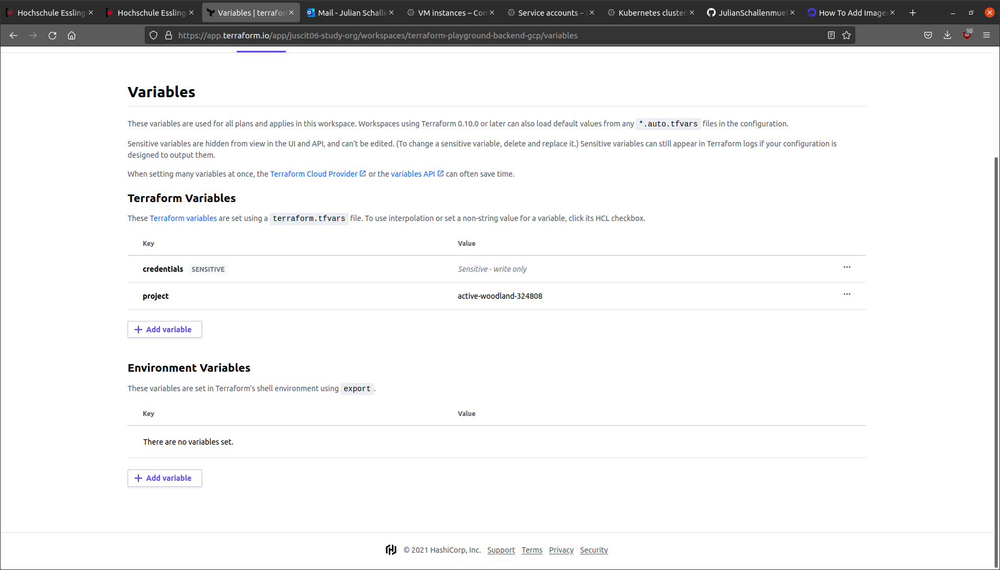

## Demo for statefile and (sensitive) variables in backend

The terraform state file which is Terraforms source of truth about the state of any deployed resources can be stored in a remote backend such as Terraform Cloud.
Terraform recommends to do so in any production environment or when any meaningful infrastructure is managed due to the advantages it provides in safety and ease of collaboration with multiple team members working on the same project.
\
\
This is a simple example how to create a backend to store sensitive variables and the `terraform.tfstate` file in a backend, here the Terraform Cloud is being used.

`backend.tf`:

```terraform
terraform {
  backend "remote" {
    organization = "juscit06-study-org"

    workspaces {
      name = "terraform-playground-backend-gcp"
    }
  }
}
```

Sensitive variable in `variables.tf`:

```terraform
variable "credentials" {
  description = "gcp project key"
  type        = string
  sensitive   = true
}
```

The variable being used to authenticate to Google Cloud Platform:

```terraform
provider "google" {
  credentials = var.credentials

  project = var.project
  region  = var.region
  zone    = var.zone
}
```

Sensitive and non-sensitive variables in the Terraform Cloud: 




